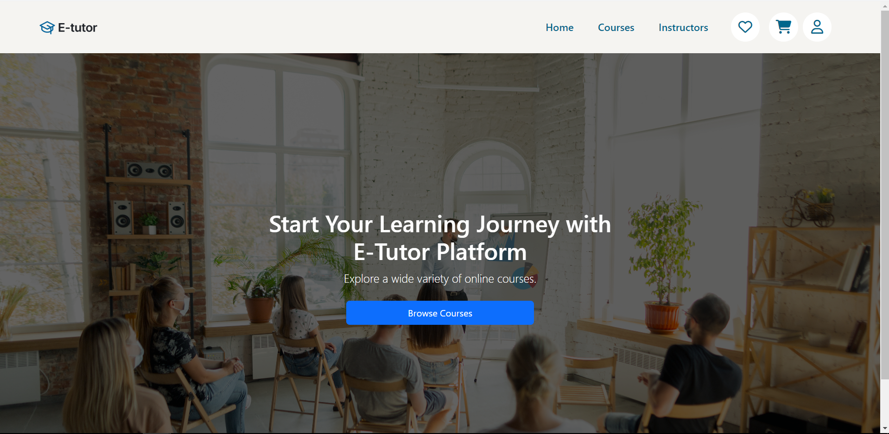
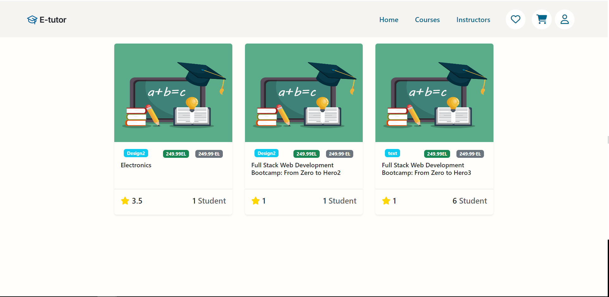
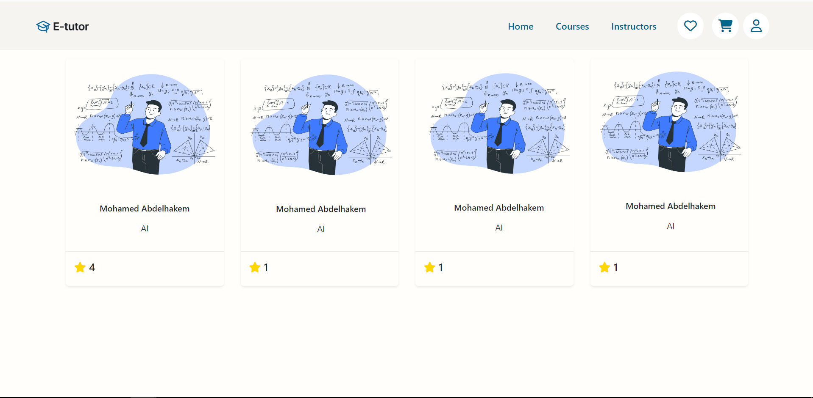
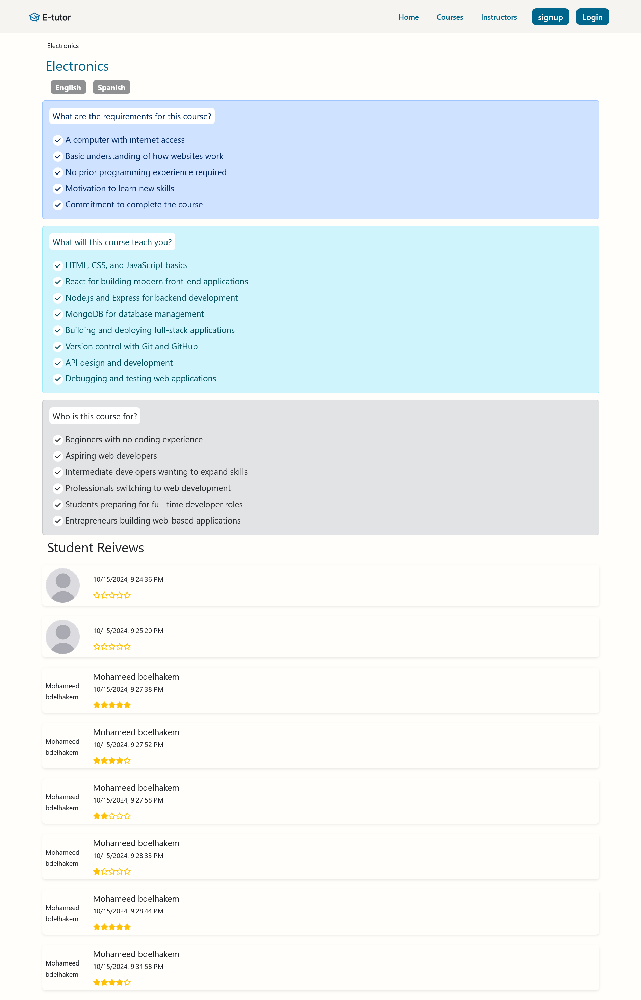

# E-Tutor Educational Platform

We intend for this platform to be a universal hub for exchanging knowledge.

## Running the project in dev. mode:

### Server side:
- Change directory into the server directory 
    ### `cd .\Server`
- Install dependencies 
    ### `npm install`
- Start the server:  
    ### `npm run start`

### Now the client side: 
- Change directory into the server directory 
    ### `cd .\Client`
- Install dependencies 
    ### `npm install`
- Start the dev. server:  
    ### `npm run start`
Runs the app in the development mode.\
Open [http://localhost:3000](http://localhost:3000) to view it in your browser.

### Thre are detailed istructions for different run modes o  the react app inside the [README](./SourceCode/Client/README.md) of client folder

## Screenshots:
### Landing Page:

### Browse Courses Page:

### Instructors Page:

### Individual Course Page:

## Documentation:
### The documentation can be found [here](./Documentation/)

- This is a simple use case case diagram showing the main activitiees of the system, where black usecases are of higher priority than the yellow ones  

- A low fidelity prototype of the "member" journe can be found [here](./Documentation/Wireframes_Student.pdf)

<object data="./Documentation/Wireframes_Student.pdf" type="application/pdf" width="1080px" height="720px">
    <embed src="./Documentation/Wireframes_Student.pdf">
        
This browser does not support PDFs. Please download the PDF to view it: <a href="./Documentation/Wireframes_Student.pdf">Download PDF</a>.

    </embed>
</object>